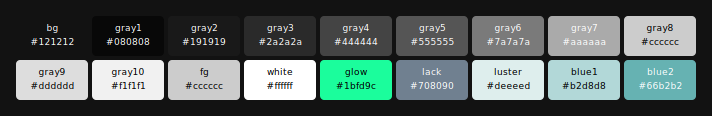
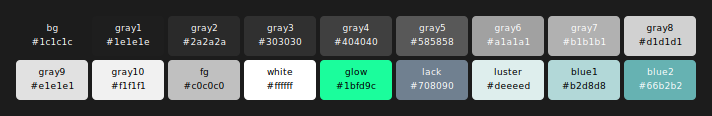
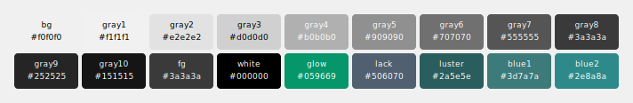
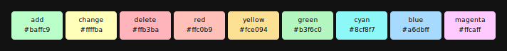

# Color Palettes

Palette visualizations and WCAG contrast metrics for all Monoglow styles.

> **WCAG 2.1**: AA requires 4.5:1 for normal text, AAA requires 7:1.
> Contrast ratios are calculated against each style's background color.

## Monoglow Z (default)

### Contrast Ratios (against `#121212`)

| Color  | Hex       |   Ratio | AA  | AAA | Usage                |
| ------ | --------- | ------: | :-: | :-: | -------------------- |
| fg     | `#cccccc` | 11.67:1 |  +  |  +  | Main text            |
| gray8  | `#cccccc` | 11.67:1 |  +  |  +  | Variables, functions |
| gray7  | `#aaaaaa` |  8.06:1 |  +  |  +  | Strings, types       |
| gray6  | `#7a7a7a` |  4.36:1 |  -  |  -  | Keywords             |
| gray5  | `#555555` |  2.51:1 |  -  |  -  | Secondary text       |
| gray4  | `#444444` |  1.92:1 |  -  |  -  | Line numbers, gutter |
| glow   | `#1bfd9c` | 13.90:1 |  +  |  +  | Accent / search      |
| lack   | `#708090` |  4.62:1 |  +  |  -  | Tribute accent       |
| luster | `#deeeed` | 15.66:1 |  +  |  +  | Bright accent        |
| blue1  | `#b2d8d8` | 12.23:1 |  +  |  +  | Blue accent 1        |
| blue2  | `#66b2b2` |  7.65:1 |  +  |  +  | Blue accent 2        |

---

## Monoglow Lack

### Contrast Ratios (against `#101010`)

| Color  | Hex       |   Ratio | AA  | AAA | Usage                |
| ------ | --------- | ------: | :-: | :-: | -------------------- |
| fg     | `#cccccc` | 11.85:1 |  +  |  +  | Main text            |
| gray8  | `#cccccc` | 11.85:1 |  +  |  +  | Variables, functions |
| gray7  | `#aaaaaa` |  8.19:1 |  +  |  +  | Strings, types       |
| gray6  | `#7a7a7a` |  4.43:1 |  -  |  -  | Keywords             |
| gray5  | `#555555` |  2.55:1 |  -  |  -  | Secondary text       |
| gray4  | `#444444` |  1.95:1 |  -  |  -  | Line numbers, gutter |
| glow   | `#1bfd9c` | 14.11:1 |  +  |  +  | Accent / search      |
| lack   | `#708090` |  4.69:1 |  +  |  -  | Tribute accent       |
| luster | `#deeeed` | 15.91:1 |  +  |  +  | Bright accent        |
| blue1  | `#b2d8d8` | 12.42:1 |  +  |  +  | Blue accent 1        |
| blue2  | `#66b2b2` |  7.77:1 |  +  |  +  | Blue accent 2        |

---

## Monoglow Void

### Contrast Ratios (against `#1c1c1c`)

| Color  | Hex       |   Ratio | AA  | AAA | Usage                |
| ------ | --------- | ------: | :-: | :-: | -------------------- |
| fg     | `#c0c0c0` |  9.37:1 |  +  |  +  | Main text            |
| gray8  | `#d1d1d1` | 11.16:1 |  +  |  +  | Variables, functions |
| gray7  | `#b1b1b1` |  7.95:1 |  +  |  +  | Strings, types       |
| gray6  | `#a1a1a1` |  6.60:1 |  +  |  -  | Keywords             |
| gray5  | `#585858` |  2.40:1 |  -  |  -  | Secondary text       |
| gray4  | `#404040` |  1.64:1 |  -  |  -  | Line numbers, gutter |
| glow   | `#1bfd9c` | 12.64:1 |  +  |  +  | Accent / search      |
| lack   | `#708090` |  4.20:1 |  -  |  -  | Tribute accent       |
| luster | `#deeeed` | 14.25:1 |  +  |  +  | Bright accent        |
| blue1  | `#b2d8d8` | 11.12:1 |  +  |  +  | Blue accent 1        |
| blue2  | `#66b2b2` |  6.96:1 |  +  |  -  | Blue accent 2        |

---

## Monoglow Light

### Contrast Ratios (against `#f0f0f0`)

| Color  | Hex       |  Ratio | AA  | AAA | Usage                |
| ------ | --------- | -----: | :-: | :-: | -------------------- |
| fg     | `#3a3a3a` | 9.98:1 |  +  |  +  | Main text            |
| gray8  | `#3a3a3a` | 9.98:1 |  +  |  +  | Variables, functions |
| gray7  | `#555555` | 6.54:1 |  +  |  -  | Strings, types       |
| gray6  | `#707070` | 4.35:1 |  -  |  -  | Keywords             |
| gray5  | `#909090` | 2.80:1 |  -  |  -  | Secondary text       |
| gray4  | `#b0b0b0` | 1.90:1 |  -  |  -  | Line numbers, gutter |
| glow   | `#059669` | 3.31:1 |  -  |  -  | Accent / search      |
| lack   | `#506070` | 5.67:1 |  +  |  -  | Tribute accent       |
| luster | `#2a5e5e` | 6.44:1 |  +  |  -  | Bright accent        |
| blue1  | `#3d7a7a` | 4.32:1 |  -  |  -  | Blue accent 1        |
| blue2  | `#2e8a8a` | 3.60:1 |  -  |  -  | Blue accent 2        |

---

## Shared Colors (Git & Diagnostics)

These colors are consistent across all Monoglow styles.

### Contrast Ratios (against `#121212`)

| Color   | Hex       |   Ratio | AA  | AAA | Usage        |
| ------- | --------- | ------: | :-: | :-: | ------------ |
| add     | `#baffc9` | 16.27:1 |  +  |  +  | Git add      |
| change  | `#ffffba` | 18.08:1 |  +  |  +  | Git change   |
| delete  | `#ffb3ba` | 11.07:1 |  +  |  +  | Git delete   |
| red     | `#ffc0b9` | 12.04:1 |  +  |  +  | Error        |
| yellow  | `#fce094` | 14.48:1 |  +  |  +  | Warning      |
| green   | `#b3f6c0` | 15.04:1 |  +  |  +  | Success / Ok |
| cyan    | `#8cf8f7` | 15.06:1 |  +  |  +  | Info         |
| blue    | `#a6dbff` | 12.67:1 |  +  |  +  | Hint         |
| magenta | `#ffcaff` | 13.51:1 |  +  |  +  | Special      |
